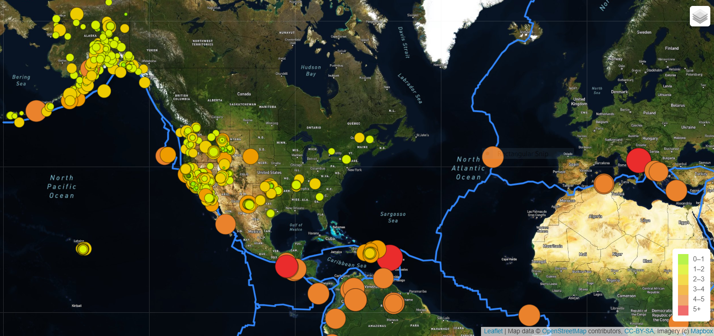

### Mapping_Earthquakes Challenge

Overview Challenge:

In this challenge interactive maps were created with Leaflet.js Application Programming Interface (API) with GeoJSON earthquake data from a URL.

## Resources:

Software:
* Mapbox
* Leaflet 
* JavaScript D3 library

## Data:
* GeoJSON tectonicplates:
https://raw.githubusercontent.com/fraxen/tectonicplates/master/GeoJSON/PB2002_boundaries.json

* GeoJSON 4.5 magnitute Earthqukes:
https://earthquake.usgs.gov/earthquakes/feed/v1.0/summary/4.5_week.geojson

## Summary:

In this interactive map , 3 layers were created: 
* streets
* satelite
* light

3 overlay objects were created:
* earthquakes
* tectonic plates
* earthquakes 4.5+ magnitute 

### Satelite view with earthquakes and tectonic plates

### Tectonic plates

### Major earthquakes of +4.5 magnitude

